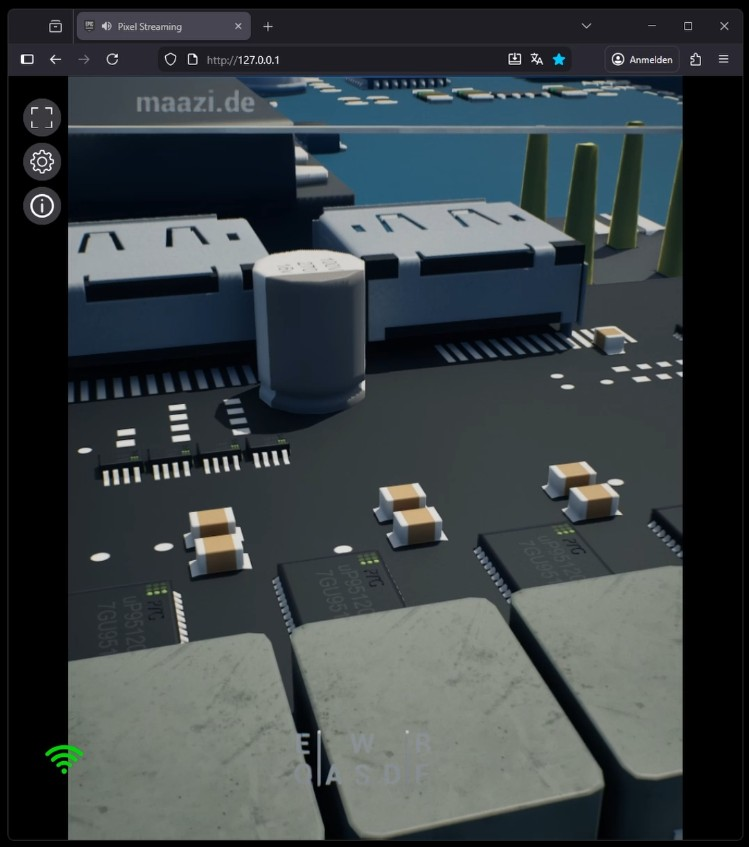

# Enterprise Documentation: Unreal Engine Mobile/PC VR/XR Pixel Streaming Infrastructure (Hybrid)

**Version:** 3.1.0  
**Platform:** Ubuntu 24.04 LTS  
**Target:** Intranet & Internet! High-End PC + UE CAD --stream--> Server --stream--> Browser  
**Status:** Production Ready

1. [Introduction](#1-introduction)
2. [Architecture Overview](#2-architecture-overview)
3. [VR/XR Specifics](#3-vrxr-specifics)
4. [Requirements](#4-requirements)
5. [Installation](#5-installation-the-setup-script)
6. [UE Project Config](#6-unreal-engine-project-configuration)
7. [Operation & Maintenance](#7-operation--maintenance)
8. [Security & Hardening](#8-security--hardening)
9. [Troubleshooting](#9-troubleshooting)
10. [Appendix](#10-appendix-bash-script)

## 1. Introduction

Welcome to the **Unreal Engine Pixel Streaming Infrastructure** docs. Run high-quality 3D apps (sims, VR, XR) in browsers without client installs.

### Why?

- **Beginners:** Few commands, script handles rest.
- **Pros:** Best practices (sec, isolation, SSL, systemd).
- **Flex:** Cloud/Hybrid modes, flat/VR streaming.

### Goal

**README.md** explains how & why. Understandable for apprentices, approvable by admins. **Bilingual: English / Deutsch.**

## 2. Architecture Overview

Two modes:

### Mode 1: Cloud Rendering

UE on server.

- Req: **NVIDIA or AMD GPU**.
- Pro: Best perf, secure.
- Con: Costly GPU.
- For: Public, VR, security.

### Mode 2: Hybrid

UE local, server signals.

- Req: No GPU server.
- Pro: Cheap.
- Con: Latency.
- For: Internal tests.

| Feature    | Mode 1 Cloud  | Mode 2 Hybrid  |
| ---------- | ------------- | -------------- |
| GPU Server | ✅ NVIDIA/AMD | ❌ No          |
| Latency    | 🟢 Low        | 🟠 High        |
| Costs      | 🔴 High       | 🟢 Low         |
| VR         | ✅ Yes        | ⚠️ Conditional |

## 3. VR/XR Specifics

Supports VR/XR via WebXR.

Reqs:

1. 90+ FPS
2. <20-30ms latency
3. 50-100 Mbps/user
4. 2x GPU load

Rec: Mode 1, close server (e.g. Frankfurt).

## 4. Requirements

Hardware:

- Ubuntu 24.04
- GPU Mode 1: NVIDIA/AMD (AMD: mesa-vulkan)
- 8+ GB RAM, 4 cores

Network:

- Domain, A-Record
- Ports 80/443/22 open

Software:

- UE packaged
- SSH

## 5. Installation

Use **[install_pixelstreaming.sh](./install_pixelstreaming.sh)** (bilingual, AMD-ready).

1. `nano install_pixelstreaming.sh`, copy from link.
2. `chmod +x`
3. `sudo ./install_pixelstreaming.sh`
4. Inputs: Lang, Domain, Email, Mode, GPU, Binary, VR (validated)
5. Upload UE files.

## 6. UE Project Config

Plugins: Pixel Streaming, OpenXR/WebXR.

Settings:
| Setting | Path | Value |
|-------------------|------------------|------------------------|
| Linux | Platforms | Server |
| VR | Virtual Reality | OpenXR, True |
| Pixel Streaming | | bEnableWebXR True |
| Encoder | | H.264 |

Launch:
Flat: `-PixelStreamingURL=ws://domain:8888 -ForceRes=1920x1080 -Windowed`
VR: `-VR ... -UseVulkan`

## 7. Operation & Maintenance

Status: `systemctl status ue-signaling`
Logs: `journalctl -u ue-signaling -f`
Restart: `systemctl restart ...`
Updates: unattended-upgrades

## 8. Security

SSH keys only, UFW limited, Let's Encrypt, non-root user, WebXR headers.

## 9. Troubleshooting

| Issue        | Cause     | Fix                                   |
| ------------ | --------- | ------------------------------------- |
| 502          | Signaling | status ue-signaling                   |
| Black Screen | GPU       | nvidia-smi / vulkaninfo               |
| Timeout      | FW        | ufw status                            |
| No VR Btn    | Browser   | Chrome/Edge                           |
| Latency      | Distance  | Close server                          |
| SSL          | DNS       | Wait 10min                            |
| AMD Vulkan   | Driver    | apt mesa-vulkan firmware-amd-graphics |

## 10. Appendix

See **[install_pixelstreaming.sh](./install_pixelstreaming.sh)**.

## History

| Version | Date       | Author | Change                |
| ------- | ---------- | ------ | --------------------- |
| 1.0     | 05.03.2026 | Besem  | Initial               |
| 3.0     | 06.03.2026 | Besem  | Base                  |
| 3.1.0   | 06.03.2026 | Cline  | AMD, BiLang, UX, Link |

**End EN**
